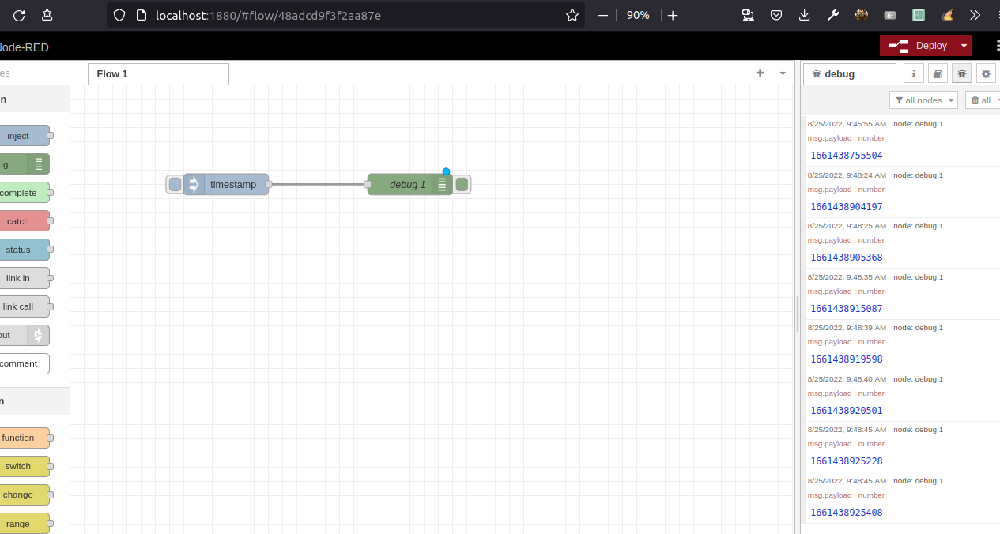

# Título
Flow1

## Introducción
Para este ejercicio solo se mostrará la hora del sistema desde la operación TimeStamp

## Material

### Software
Para realizar este flow se utiliza lo siguiente
- Ubuntu 22.04
- Firefox 103.0.2
- NodeJS
    - NPM
    - NodeRed
    - Nodos de Dashboard

### Hardware
- HP Zbook 14
- Memoria RAM de 8 GB
- Procesador core i5

### Referencias

### Requisitos previos
Para que este flow funcione, debes cumplir con los siguientes requisitos previos

    1. Instalación de NodeJS. Se recomienda tener instalado NodeJS en alguna versión LTS. Al momento de creación de este documento, se usó la versión 16.17.0LTS. Esta instalación debe incluir las Build-Tools para hacer uso de NPM
    2. Instalación de NodeRed. La instalación se realiza por NPM. Al momento de la creación de este contenido, se usó la versión 3.0.2

### Preparación del entorno
- Se ejecuta desde la terminal node-red
- En el navegador ingresar la dirección localhost:1880

### Operación

## Resultados

## Evidencias
[Archivo](flow1.json)

## Créditos
- [Desarrollado por ghigoviu](https://github.com/ghigoviu)

